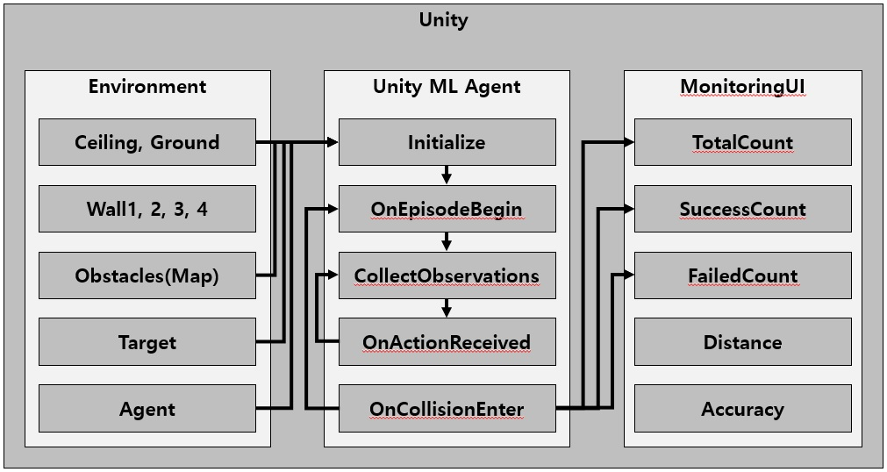
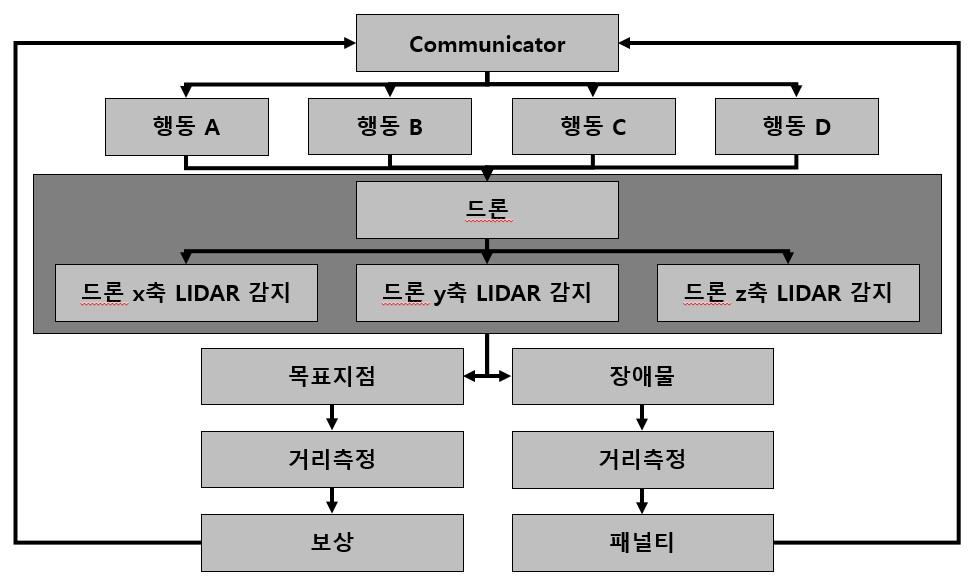

# Auto Flight ML-Agents
This is Drone Autonomous Flight using Unity ML-Agents.  
본 프로젝트는 Unity ML Agent를 활용한 LiDAR 기반 머신러닝을 이용한 드론 자율비행 시스템으로, 장애물(사물)을 회피하여 목적지까지 자율적으로 비행하는 시스템이다. LiDAR를 이용하여 장애물(사물)을 탐지하고, 탐지한 장애물(사물)의 거리정보를 기반으로 Unity ML Agent Package를 이용하여 PPO(Proximal Policy Optimization) 기반의 머신러닝을 수행하여, 드론 비행 시 발생하는 장애물에 대한 회피 알고리즘을 제안하고, 테스트환경에서 수행한 뒤 성능을 확인한다.
- [Unity ML-Agent](https://github.com/Unity-Technologies/ml-agents): https://github.com/Unity-Technologies/ml-agents


## 1. Environments

- Unity
- Unity ML Agent
- C# Script
- Anaconda3(Python 3.8.5)
- Window 10
- Intel Core i5-6600
- RAM DDR4-2133MHz(PC4-17000) 16GB
- NVIDIA GeForce GTX 1060 6GB

### 1. 1 Unity ML-Agents
Download recent version of release branch at https://github.com/Unity-Technologies/ml-agents.  
The location of 'ml-agents' is like below or free.
```
ㄴroot
  ㄴAutoFlight  
  ㄴImages  
  ㄴml-agents  
```


## 2. Main Configuration

### 2. 1 Main Architecture
This image shows how drone autonomous flight machine learning works.  
Unity ML-Agents has 5 different functions.
**`Initialize`, `OnEpisodeBegin`, `CollectObservations`, `OnActionReceived`, `Heuristic`.**

<p align="center"></p>

### 2. 2 Sub Arhitecture
This image shows how **`agent`** learn.
<p align="center"></p>


### 2. 3 LiDAR based on Automous Flight
Simulation for Drone Autonomous Flight with Lidar System
<p align="center"></p>


## 3. Train
### 3. 1 Set Learning Environment
<p align="center"></p>

### 3. 2 Training
After set learning environment, start machine learning with `Anaconda3` like below.
<p align="center"></p>
<p align="center"></p>
<p align="center"></p>
<p align="center"></p>

## 4. Run

### 4. 1 Analyzer.py
```bash

```
- `Analyzer.py` will analyze the data of coin price at the time of execution.
- Analyzed result will be saved in `root` directory as `.xlsm` file.

### 4. 2 AutoTraderV1.py
```
python AutoTraderV1.py
```
AutoTrader will trading Top20 rate of increase.
- You should edit Upbit API keys in `AutoTraderV1.py` which are `access_key` & `secret_key`.
- This will be update as soon as possible.

### 4. 3 AIAutoTraderV1.py
```
python AIAutoTraderV1.py
```
AIAutoTrader will trading 20 stocks that will give you the best returns.
- You should edit Upbit API keys in `AIAutoTraderV1.py` which are `access_key` & `secret_key`.
- This is unusable now cause it's not completed.
- This will be update as soon as possible.

## 5. Results

### 5. 1 Daily Analysis

<p align="center"></p>
